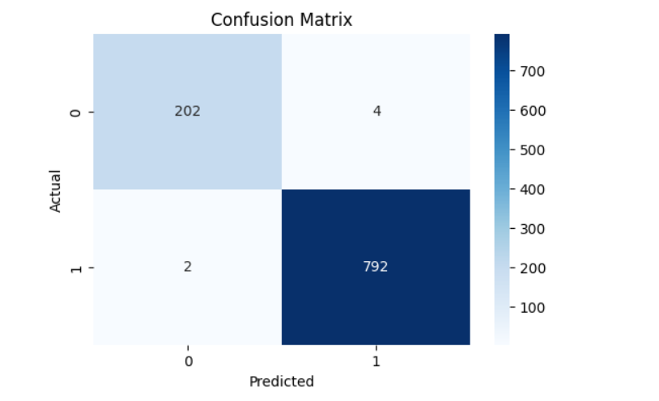
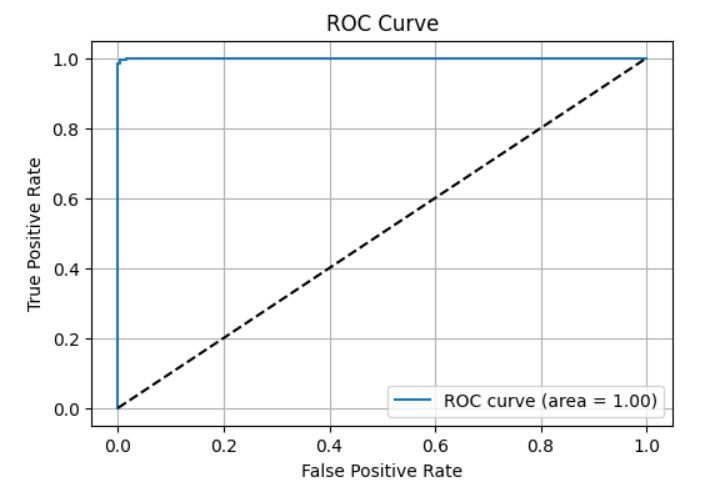
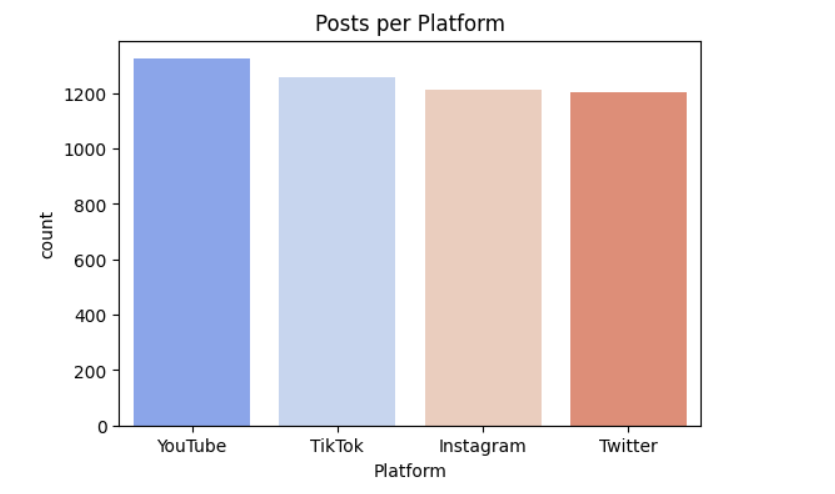
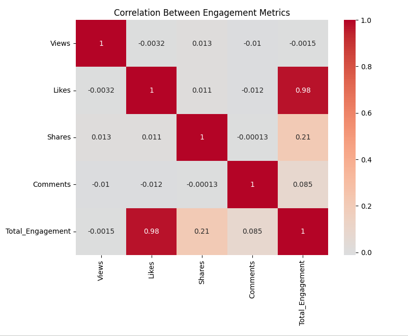

# 📈 Social Media Trends Prediction

A Machine Learning project that predicts whether a social media post is likely to become **trending** based on user engagement metrics such as views, likes, shares, comments, hashtags, platform, and posting time.

This project uses **Logistic Regression** for binary classification and was developed using **Python, Scikit-learn, Pandas, Matplotlib, and Google Colab**.

---

## 🚀 Technologies Used

- Python
- Google Colab
- Pandas
- NumPy
- Scikit-learn
- Matplotlib
- Seaborn
- Git & GitHub

---

## 🏗️ Project Architecture

```text
Social Media Dataset (CSV)
            │
            ▼
     Data Preprocessing
            │
            ▼
    Feature Engineering
            │
            ▼
   Logistic Regression Model
            │
            ▼
 Prediction (Trending / Not Trending)
            │
            ▼
 Evaluation & Visualization
```

---

## 📊 Project Overview

The model analyzes engagement-related features from social media posts and predicts whether a post will become viral or trending.

### Input Features

- Views
- Likes
- Shares
- Comments
- Platform
- Hashtag
- Content Type
- Region
- Engagement Level
- Post Date

### Output

- **1** → Trending Post
- **0** → Not Trending Post

---

## ✨ Features

- Predicts trending vs non-trending social media posts.
- Data preprocessing and feature engineering.
- One-Hot Encoding for categorical features.
- StandardScaler for numerical feature normalization.
- Logistic Regression classification model.
- Confusion Matrix and ROC Curve evaluation.
- Multiple data visualizations for engagement analysis.

---

## 📁 Dataset

**Dataset Used**

`Cleaned_Viral_Social_Media_Trends.csv`

The dataset contains social media engagement information including views, likes, shares, comments, hashtags, platform details, and posting dates.

---

## 📂 Project Structure

```text
Social-Media-Trends-Prediction/
│
├── Social_Media_Trends_Prediction.ipynb
├── Cleaned_Viral_Social_Media_Trends.csv
├── README.md
└── screenshots/
    ├── confusion_matrix.png
    ├── roc_curve.png
    ├── engagement_distribution.png
    ├── platform_distribution.png
    └── correlation_heatmap.png
```

---

## ⚙️ Machine Learning Workflow

### 1. Data Collection

Load the CSV dataset using Pandas.

### 2. Data Preprocessing

- Handle missing values.
- Remove duplicates.
- Convert `Post_Date` into Month and Day of Week.
- One-Hot Encode categorical columns.
- Scale numerical features.

### 3. Feature Engineering

Selected engagement features are transformed into machine learning-ready features.

### 4. Model Training

The dataset is split into training and testing sets using `train_test_split()`.

**Model Used**

- Logistic Regression

### 5. Prediction

The trained model predicts whether a post is trending or not.

### 6. Evaluation

Performance is measured using:

- Accuracy
- Precision
- Recall
- F1 Score
- ROC-AUC Score

---

## 📈 Model Performance

| Metric | Value |
|--------|------:|
| Accuracy | **0.991** |
| Precision | **0.9936** |
| Recall | **0.9948** |
| F1 Score | **0.9942** |
| ROC-AUC | **0.9998** |

The model achieved excellent classification performance for predicting trending social media posts.

---

## 📊 Visualizations

The project includes visual analysis such as:

- Confusion Matrix
- ROC Curve
- Likes Distribution
- Shares Distribution
- Comments Distribution
- Platform-wise Posts
- Region-wise Posts
- Monthly Engagement Trend
- Correlation Heatmap

## 🖼️ Model Output Screenshots

### Confusion Matrix



### ROC Curve



### Platform Distribution



### Correlation Heatmap



---

## ▶️ Run the Project

Install the required libraries:

```bash
pip install pandas numpy scikit-learn matplotlib seaborn
```

Run the notebook using:

- Google Colab
- Jupyter Notebook

---

## 📌 Future Enhancements

- Implement Random Forest and XGBoost models.
- Add Sentiment Analysis from post text.
- Use Deep Learning for trend prediction.
- Support real-time social media trend monitoring.
- Deploy as a Streamlit web application or REST API.

---

## 🔐 Project Notes

- Developed in **Google Colab**.
- Version controlled using **GitHub**.
- Suitable for Machine Learning and Data Science projects.

---

## 👩‍💻 Author

**Saranya G**

Frontend Developer | AI / ML & Data Science Enthusiast
